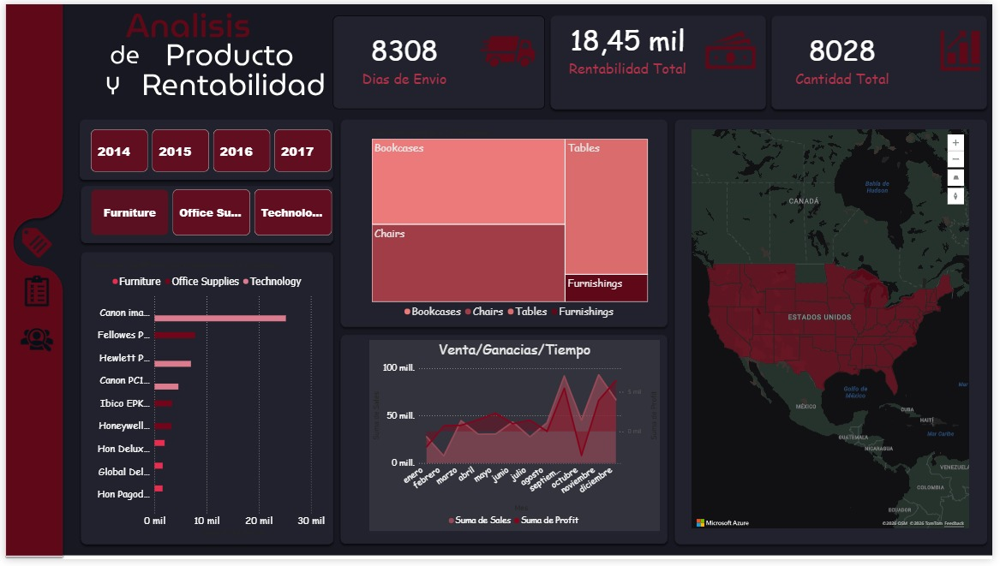
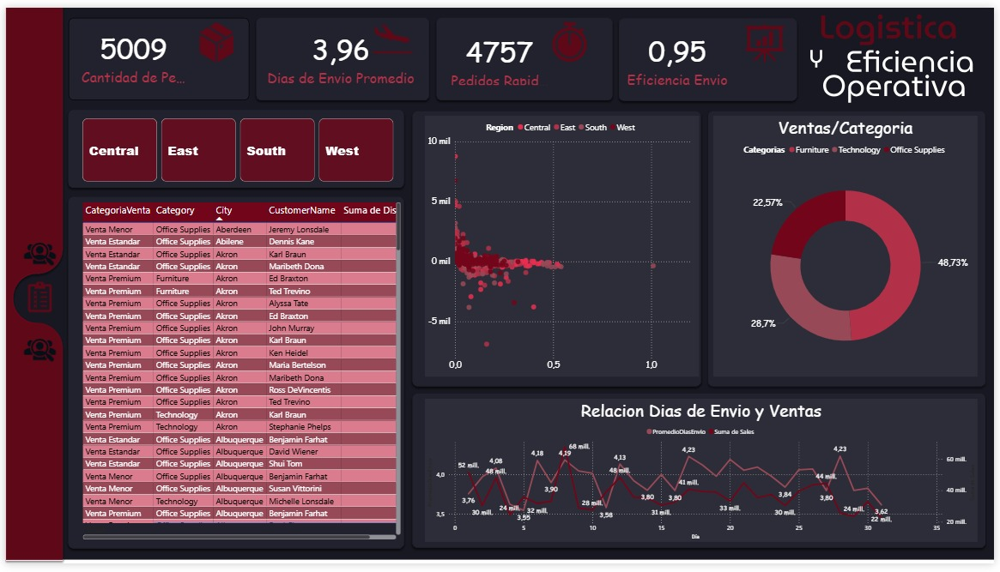
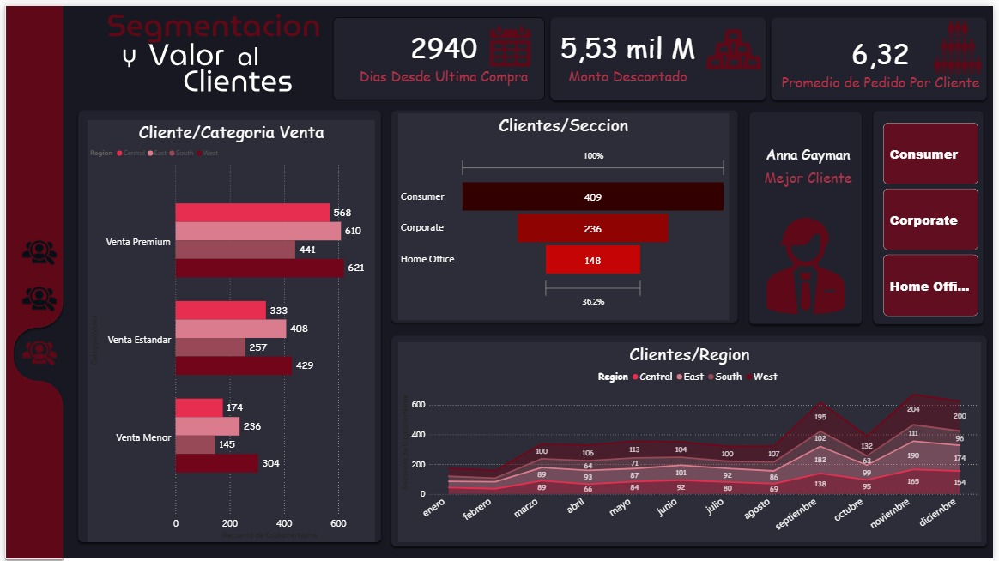

# Proyecto-Analisis-SuperStore
Proyecto de ETL y Análisis de Datos usando SQL y Power BI
Este proyecto demuestra un flujo completo de ingeniería de datos, desde la limpieza con **Python**, el modelado y automatización en **SQL Server**, hasta la visualización estratégica en **Power BI**. Diseñado para transformar datos transaccionales en insights accionables.

##  Tecnologías Utilizadas
* **Lenguajes:** Python (Pandas para ETL), T-SQL (Programación de Base de Datos).
* **Base de Datos:** SQL Server (Esquema en Estrella).
* **Visualización:** Power BI (Diseño UX/UI).

##  Estructura del Proyecto
* `/data`: Datasets originales y procesados.
* `/python-scripts`: Código de limpieza y estandarización de datos.
* `/sql-scripts`: Creación de tablas, migración, triggers y vistas optimizadas.
* `/powerbi-report`: Archivo .pbix y recursos de diseño.

##  Logros Técnicos

### 1. Modelado y Programación SQL
* **Triggers de Auditoría:** Implementación de disparadores para el rastro de cambios en el catálogo de productos.
* **Stored Procedures con ACID:** Procesos de migración robustos con manejo de transacciones y control de errores (Try-Catch).
* **Capa de Vistas:** Vistas centralizadas con lógica de negocio para optimizar la conexión con Power BI.

### 2. Dashboard de Inteligencia de Negocios
El reporte interactivo se divide en tres áreas clave:
* **Segmentación:** Identificación de clientes Premium y análisis de valor.
* **Logística:** Monitoreo de eficiencia operativa y tiempos de envío.
* **Rentabilidad:** Análisis geoespacial y estacionalidad de ventas.

##  Visualización del Dashboard

---
**Desarrollado por:** Jorge Rafael Roncal Saravia
**Propósito:** Portafolio para Prácticas Pre-profesionales.

